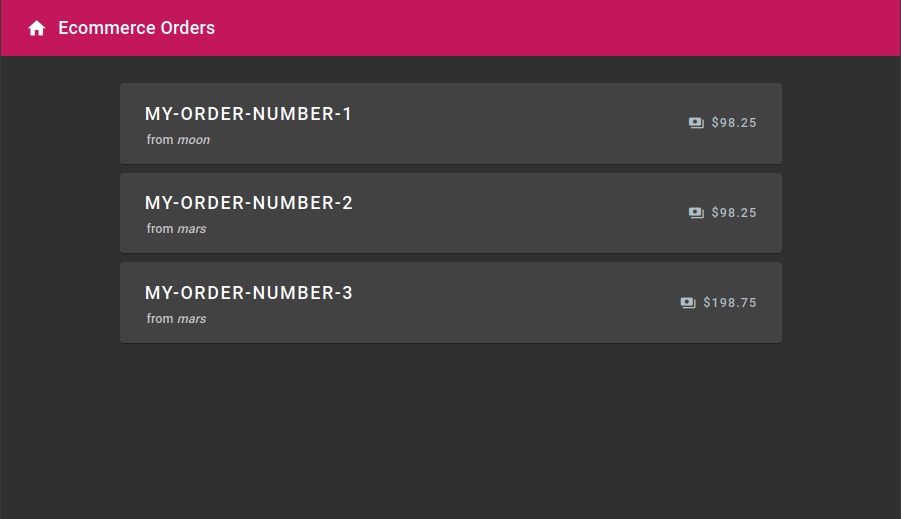
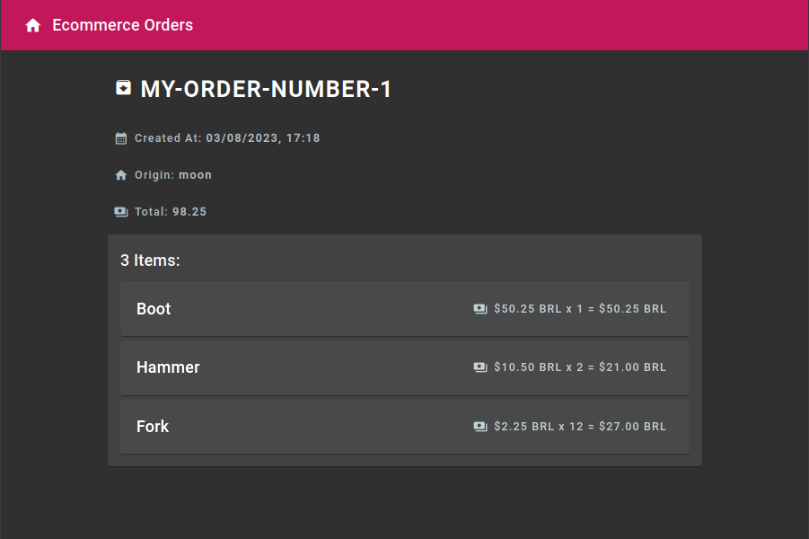
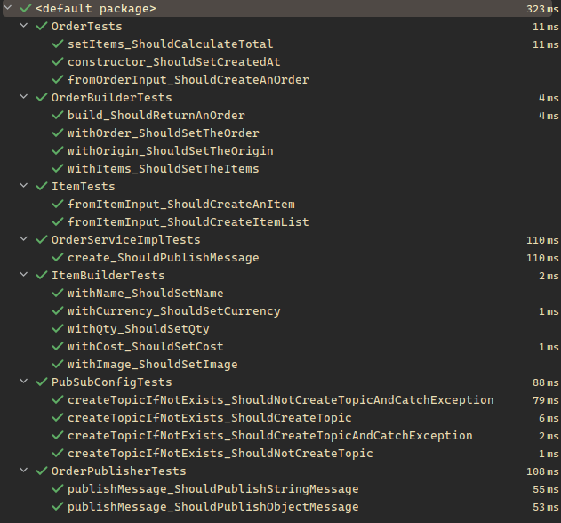
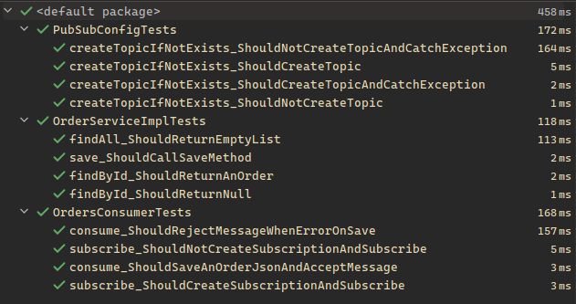

# ecommerce

Simple Ecommerce endpoints using GraphQL and PubSub.
<br>

## Summary
1. [Basic features](#basic-features)
2. [Run locally](#run-locally)
3. [API Usage](#api-usage)
4. [Front End](#front-end)
5. [Unit Tests](#unit-tests)

### Basic features:
- Receive orders from third parties origins.
- Visualize all orders.

### Run locally:

1. Install Docker and Docker Compose.

2. Clone the repository and cd into it:

```bash
git clone https://github.com/SirVoRaK/ecommerce && \
cd ecommerce
```

3. Build the docker images:

```bash
docker build -t ecommerce-publisher ecommerce-publisher && \
docker build -t ecommerce-consumer ecommerce-consumer && \
docker build -t ecommerce-frontend ecommerce-frontend
```

4. **__(IMPORTANT)__** Create the data folder:

```bash
mkdir data && \
mkdir data/mongodb && \
mkdir data/pubsub
```

5. Run the containers:
    1. Keep attached:
    ```bash
    docker compose up
    ```

    2. Run in background:
    ```bash
    docker compose up -d
    ```

6. Stop the container:

```bash
docker compose down
```

### API Usage:

#### Publish an order:
##### Example Request:
**POST** __http://localhost:8001/graphql__

```graphql
mutation {
    publishPlacedOrderMessage(order: {
        order: "MY-ORDER-NUMBER-1",
        origin: "moon",
        items: [
            {
                name: "Boot",
                image: "image-path.png",
                qty: 1,
                cost: 50.25,
                currency: "BRL"
            },
            {
                name: "Hammer",
                image: "image-path.png",
                qty: 2,
                cost: 10.5,
                currency: "BRL"
            },
            {
                name: "Fork",
                image: "image-path.png",
                qty: 12,
                cost: 2.25,
                currency: "BRL"
            }
        ]
    }) {
        success,
        message
    }
}
```

##### Example Response:
```json
{
    "data": {
        "publishPlacedOrderMessage": {
            "success": true,
            "message": "Order created successfully"
        }
    }
}
```

#### List all orders:
##### Example Request:
**POST** __http://localhost:8002/graphql__

```graphql
query {
    placedOrders {
        id,
        order,
        origin,
        total,
        createdAt,
        items {
            name,
            image,
            qty,
            cost,
            currency
        }
    }
}
```

##### Example Response:
```json
{
    "data": {
        "placedOrders": [
            {
                "id": "64cc0ba8dd694012b48b31ee",
                "order": "MY-ORDER-NUMBER-1",
                "origin": "moon",
                "total": 98.25,
                "createdAt": "2023-08-03T17:18:48.051946324",
                "items": [
                    {
                        "name": "Boot",
                        "image": "image-path.png",
                        "qty": 1,
                        "cost": 50.25,
                        "currency": "BRL"
                    },
                    {
                        "name": "Hammer",
                        "image": "image-path.png",
                        "qty": 2,
                        "cost": 10.5,
                        "currency": "BRL"
                    },
                    {
                        "name": "Fork",
                        "image": "image-path.png",
                        "qty": 12,
                        "cost": 2.25,
                        "currency": "BRL"
                    }
                ]
            }
        ]
    }
}
```

#### Get Order By Id:
##### Example Request:
**POST** __http://localhost:8002/graphql__

```graphql
query {
	placedOrder (id: "64cc0ba8dd694012b48b31ee") {
		id,
		order,
		origin,
		total,
		createdAt,
		items {
			name,
			image,
			qty,
			cost,
			currency
		}
	}
}
```

##### Example Response:
```json
{
	"data": {
		"placedOrder": {
			"id": "64cc0ba8dd694012b48b31ee",
			"order": "MY-ORDER-NUMBER-1",
			"origin": "moon",
			"total": 98.25,
			"createdAt": "2023-08-03T17:18:48.051946324",
			"items": [
				{
					"name": "Boot",
					"image": "image-path.png",
					"qty": 1,
					"cost": 50.25,
					"currency": "BRL"
				},
				{
					"name": "Hammer",
					"image": "image-path.png",
					"qty": 2,
					"cost": 10.5,
					"currency": "BRL"
				},
				{
					"name": "Fork",
					"image": "image-path.png",
					"qty": 12,
					"cost": 2.25,
					"currency": "BRL"
				}
			]
		}
	}
}
```

### Front End
Accessing `http://localhost:8000/orders` in your browser you will see:


Accessing `http://localhost:8000/orders/ID` you will see:


### Unit Tests
Both microservices are tested using JUnit and Mockito:


